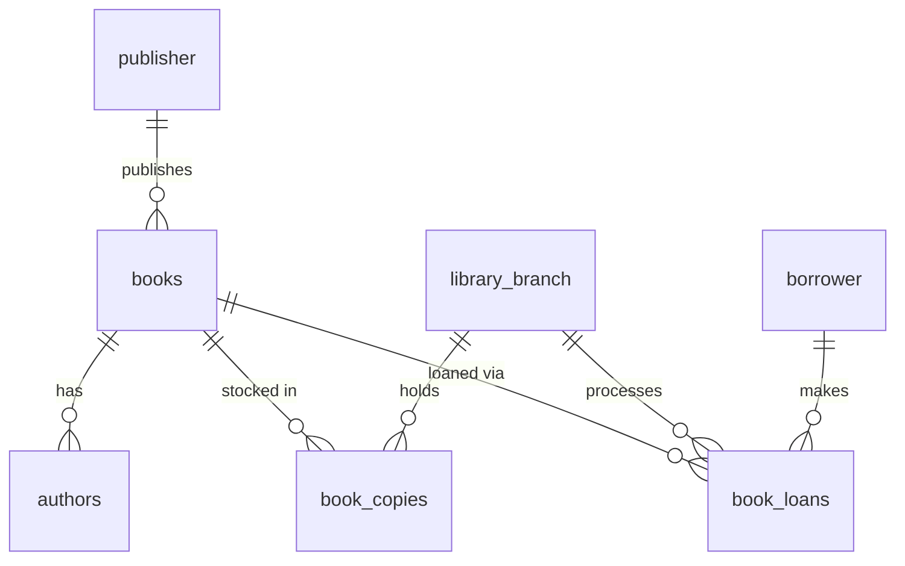

# 📚 Library Management System – SQL Database Project

## 📌 Project Overview

This project implements a fully relational **Library Management System** using MySQL.  
It demonstrates database design, normalization, foreign key implementation, and analytical SQL queries based on real-world business scenarios.

The system manages:

- 📖 Books  
- ✍️ Authors  
- 🏢 Library Branches  
- 👤 Borrowers  
- 📦 Book Copies  
- 🔄 Book Loans  
- 🏬 Publishers  

The project emphasizes **data integrity, structured schema design, and business-driven query building**.

---

# 🏗️ Database Architecture

